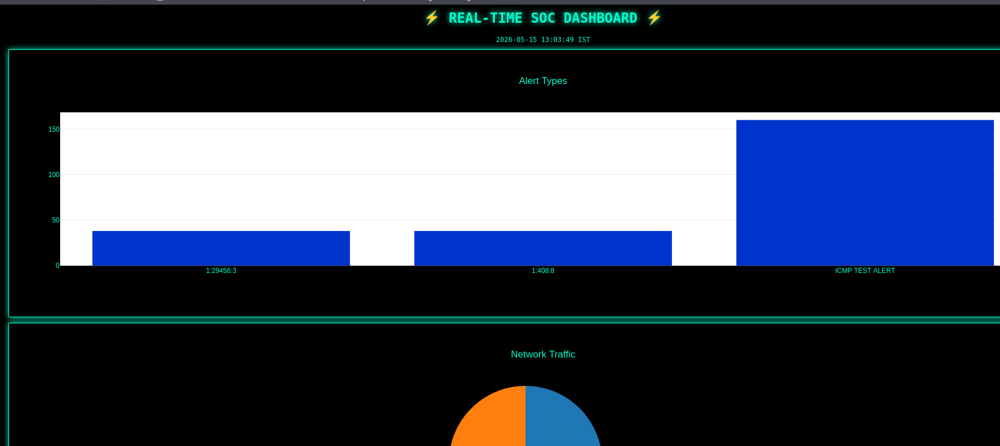
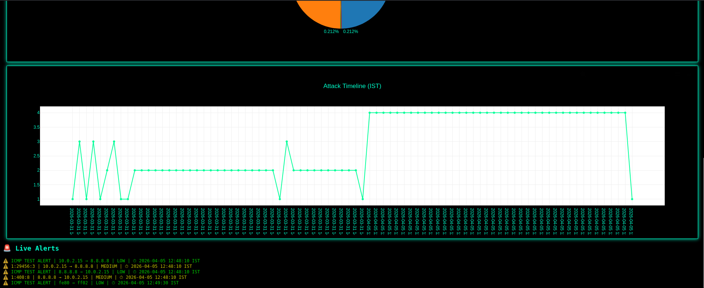

## Overview
This project is a rule-based Intrusion Detection System (IDS) developed using Snort 3.0 to monitor network traffic and detect suspicious or malicious activities.

The system analyzes packets using predefined security rules like community rules and local rules and generates alerts for potential threats. A Python-based dashboard was also developed to visualize alerts and monitored network activities.

## Features
- Real-time network traffic monitoring
- Rule-based intrusion detection
- Packet analysis and logging
- Security alert generation
- Python-based monitoring dashboard
- Visualization of detected network activities

## Technologies Used
- Snort 3.0
- Python
- Flask
- Plotly
- Pandas
- JSON
- Kali Linux / Linux
- Packet Analysis

## Dashboard Description

The dashboard provides real-time visualization of network traffic and intrusion alerts generated by Snort 3.0. It displays alert statistics, attack timelines, network activity distribution, and live security alerts through an interactive Python Flask interface.

Key dashboard components include:
- Alert type visualization
- Network traffic monitoring
- Real-time attack timeline analysis
- Live intrusion alert feed
- Severity-based alert tracking

The dashboard was developed using Flask and Plotly for interactive monitoring and visualization of detected network activities.

## Dashboard Screenshots

## Author
Jahanvi Suri
B.Tech CSE (Cyber Security)
VIT Chennai

